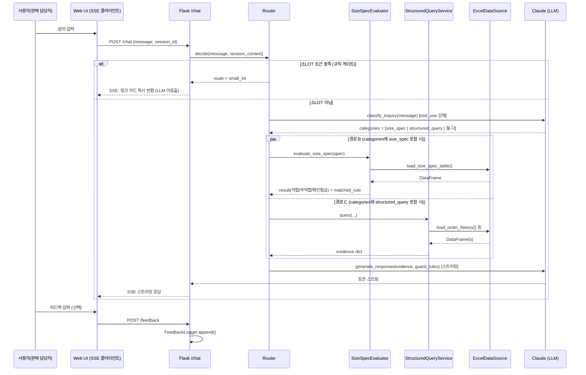

# 후판 수주 문의 응답 챗봇 — 기획서 (설계 문서)

- 작성일: 2026-07-21
- 최근 갱신: 2026-07-23 — `과제질문.xlsx`(실제 문의 예시) 분석 반영, 사이즈/여재 조회 로직 보강 (§3.3, §3.4, §5, §8, §10 신설)
- 상태: `pilot/`에 mock 데이터 기반 파일럿 구현 및 1차 검증 완료. 실제 SME 데이터/규칙 확정은 미완료.
- 산출물 범위: 설계 문서 + 파일럿 코드(`pilot/`). 실 데이터 반영은 다음 단계.

---

## 1. 개요

### 1.1 목적
판매 담당자가 후판 수주 담당자에게 반복적으로 던지는 조회성 문의(규격/사이즈 기준 적합 여부,
투입 가능 소, 소LOT/데일리 집약 여부 등)를 LLM 기반 챗봇이 1차로 응답하여 수주 담당자의
반복 업무 부담을 줄인다.

### 1.2 범위 밖 (Non-goals)
- 조합 설계의 **최종 확정** — 챗봇은 참고 의견만 제시, 최종 승인은 수주 담당자
- **단중 예측** (공정 손실·수율 등 실제 생산 변동을 감안한 추정) 기능 — 별도 과제.
  ※ 2026-07-23 명확화: 두께×폭×길이로부터 밀도 상수를 곱해 구하는 **단순 기하학적 단중
  산출**(`thickness × width × length × 7.82 / 1,000,000` = kg)은 예측이 아니라 결정론적
  계산이므로 범위에 **포함**한다 (§3.7 참고). "예측"과 "산출"을 혼동하지 않도록 응답에도
  이 값이 계산값이지 실제 생산 결과 추정치가 아님을 명시한다.
- **자동 재학습** — 피드백은 이번 단계에서 저장까지만
- **소LOT 실제 연동** — 트리거 조건 판별까지만, 연동 API는 스텁(TODO)

### 1.3 판단 경계 원칙
- 검증되지 않은 사이즈 기준 데이터는 임의로 추정/생성하지 않는다 → 데이터가 없으면 "확인 필요"로 응답
- 조합 설계 관련 응답에는 "본 응답은 참고 의견이며 최종 승인은 수주 담당자가 진행합니다" 문구를 항상 포함

---

## 2. 전체 아키텍처

```
                         ┌─────────────────────────┐
                         │   사용자 (판매 담당자)     │
                         │   단일 대화창 (SSE 스트리밍)│
                         └────────────┬────────────┘
                                      │ 문의 텍스트 (+ 주문서 컨텍스트가 있으면 첨부)
                                      ▼
                         ┌─────────────────────────┐
                         │   Step 1. 규칙 기반 게이트  │
                         │  소LOT 위임 조건 판별       │
                         │  (주문서 작성 상태 + LOT 판정)│
                         └───────┬─────────┬───────┘
                     조건 충족    │         │ 조건 미충족
                                 ▼         ▼
                  ┌──────────────────┐   ┌─────────────────────────┐
                  │ 경로 A            │   │  Step 2. LLM 의도 분류    │
                  │ 소LOT 주문 투입     │   │  (tool_use로 구조화 출력) │
                  │ 검토 에이전트 위임  │   └──────┬─────────┬───────┘
                  │ (스텁, TODO)      │   사이즈/규격    정형 데이터 조회
                  └──────────────────┘          │         │
                                                 ▼         ▼
                                    ┌──────────────────┐ ┌──────────────────────┐
                                    │ 경로 B             │ │ 경로 C                 │
                                    │ 사이즈 기준 적합성   │ │ 실적/진행/여재slab/     │
                                    │ 판단 로직 (신규)     │ │ 집약기준 종합 조회       │
                                    └────────┬──────────┘ └──────────┬───────────┘
                                             │                       │
                                             ▼                       ▼
                                    ┌─────────────────────────────────────┐
                                    │   응답 생성 (LLM, 근거자료 기반 요약)   │
                                    │   + 참고의견/최종승인 문구 삽입(경로C)  │
                                    └───────────────────┬───────────────────┘
                                                         ▼
                                              ┌─────────────────────┐
                                              │  사용자에게 스트리밍 응답 │
                                              │  + 피드백 입력 UI      │
                                              └─────────────────────┘
                                                         │
                                                         ▼
                                              ┌─────────────────────┐
                                              │  피드백 로그 저장       │
                                              │  (재학습 없음, 적재만)   │
                                              └─────────────────────┘
```

### 2.1 왜 "규칙 게이트 → LLM 분류" 순서인가
- 소LOT 위임 조건(주문서 상태, LOT 크기)은 **구조화된 필드로 판별 가능한 규칙**이므로 LLM에
  맡기지 않고 코드로 먼저 걸러낸다. 오분류 리스크를 없애고, 위임이 필요한 문의가 다른 경로로
  새는 것을 방지한다.
- 소LOT이 아닌 경우에만 LLM이 "사이즈 기준 문의"인지 "정형 데이터 조회"인지 분류한다.
  자연어 문의는 규칙만으로 구분하기 어렵기 때문 (예: "이거 사이즈 기준에 맞아?" vs
  "이 소재로 예전에 만든 적 있어?").
- 한 문의에 두 성격이 섞인 경우(복합 질문) 대비: 분류 결과를 **단일 값이 아니라 배열**로
  받아 경로 B, C를 모두 실행 후 하나의 응답으로 종합하는 것을 권장 (§4.1 참고).
- **소LOT 경로는 LLM을 아예 호출하지 않는다** — 실제 연동 없이 안내 링크만 보여주기로
  결정되어(§3.5), 분류/응답생성 단계를 건너뛰고 규칙 게이트에서 바로 링크 카드를 반환하는
  것이 속도·비용 면에서 유리하다.

### 2.2 레이어 구조 (Layered Architecture)

```
┌──────────────────────────────────────────────────────────┐
│ Presentation Layer                                         │
│  - Flask routes: POST /chat (SSE), POST /feedback          │
│  - 세션별 대화 상태 입출력                                    │
├──────────────────────────────────────────────────────────┤
│ Orchestration Layer                                         │
│  - Router: 규칙 게이트(소LOT) + LLM 의도 분류               │
│  - ResponseComposer: 경로 B/C 근거자료 병합 + 응답 생성/스트리밍│
├──────────────────────────────────────────────────────────┤
│ Domain Logic Layer                                          │
│  - SmallLotGate            (경로 A)                         │
│  - SizeSpecEvaluator        (경로 B)                         │
│  - StructuredQueryService   (경로 C: 실적/진행/여재slab/집약)  │
├──────────────────────────────────────────────────────────┤
│ Data Access Layer                                           │
│  - ExcelDataSource (현재) → DBDataSource (추후, 인터페이스 동일)│
├──────────────────────────────────────────────────────────┤
│ Cross-cutting                                                │
│  - FeedbackLogger                                            │
│  - PromptGuard (근거자료 외 내용 생성 금지 지침 적용 지점)      │
└──────────────────────────────────────────────────────────┘
```

레이어를 나누는 이유: Router/ResponseComposer(오케스트레이션)와 실제 판정 로직(도메인)을
분리해두면, 나중에 판정 규칙이 바뀌거나(예: 사이즈 기준 우선순위 로직 변경) LLM 프롬프트가
바뀌어도 서로 영향을 주지 않는다. Data Access Layer는 §3.2 원칙(엑셀→DB 전환 용이성)을
그대로 계승한다.

### 2.3 요청 처리 시퀀스



핵심 포인트:
- 경로 B/C는 **병렬(par)** 실행 — 복합 질문일 때 순차 실행으로 지연시키지 않는다.
- `evaluate_size_spec`, `query(...)`는 순수 데이터/규칙 조회만 하고 LLM을 호출하지 않는다.
  LLM은 **근거자료가 다 모인 뒤 단 한 번**만 응답 생성에 사용된다 (분류 1회 + 생성 1회 = 총
  2회 LLM 호출이 기본 흐름, 소LOT 경로는 0회).

### 2.4 대화 상태 관리
- 단일 대화창에서 여러 턴에 걸쳐 규격/주문 정보가 나올 수 있으므로(예: "SS400 후판인데" →
  다음 턴 "두께 12T, 폭 2000 기준에 맞아?") `session_id` 기준으로 **서버 메모리 dict**에
  최근 언급된 `order_context`(강종/두께/폭/길이/주문서 상태 등)를 누적한다.
- 개발 단계(로컬 실행) 기준으로는 서버 메모리 dict로 충분 — 다중 서버/재시작 내구성이
  필요해지면 Redis 등으로 교체 (지금 범위 아님, TBD로 남김).
- 새 턴마다 Router는 이번 메시지 + 누적된 `order_context`를 함께 보고 판단한다.

### 2.5 예외/폴백 처리

| 상황 | 처리 방식 |
|---|---|
| LLM 의도 분류 결과가 없음/애매함 | "어떤 종류의 문의인지 조금 더 구체적으로 말씀해 주세요"로 안내, 응답 생성 단계 진입 안 함 |
| 사이즈 기준 매칭 규칙 없음 | 코드 레벨에서 "확인 필요"로 고정, 이 사실을 evidence에 명시해 LLM에 전달 (LLM이 임의 판단 못 하도록 원천 차단) |
| 정형 데이터 조회 결과 0건 | evidence에 "조회 결과 없음"을 명시적으로 넣어 LLM이 없음을 그대로 안내하도록 유도 |
| 복합 질문 (경로 B + C 동시) | 병렬 실행 후 evidence 병합, 응답에서 "사이즈 판정 결과" / "참고 데이터" 섹션을 구분해 서술 |
| 소LOT 조건 + 다른 질문이 한 문장에 혼재 | 소LOT 감지 시 그 턴은 링크 카드만 반환하고 나머지 질문은 다음 턴에 이어서 처리 (단순화 방향 — SME 확인 필요, §8 참고) |
| 엑셀 파일 로드 실패 (파일 없음/형식 오류) | 사용자에게는 "데이터 조회 중 문제가 발생했습니다"로만 안내, 상세 오류는 서버 로그에만 기록 |
| 주문서 있음 + 소LOT 아님 (`과제질문.xlsx` "3-2) 주문서가 있는 경우"에서 확인) | 경로 A(소LOT 게이트)로 가지 않고 경로 C(정형조회)로 처리 — 실적/여재/진행상황 근거 + 참고의견 문구로 응답 |

---

## 3. 모듈 설계

### 3.1 문의 유형 판별기 (Router)
**파일 내 위치:** `app.py` 상단 라우팅 섹션

```python
def is_small_lot_delegation(order_context: dict) -> bool:
    """규칙 기반 1차 게이트. 주문서 작성 여부 + 소LOT 판정."""
    # TODO: 소LOT 판정 기준(톤수/매수 threshold 등)은 데이터 확인 후 확정
    ...

def classify_inquiry(user_message: str, order_context: dict | None) -> list[str]:
    """LLM tool_use로 구조화 분류. 반환값 예: ["size_spec"], ["structured_query"],
    혹은 복합 질문이면 ["size_spec", "structured_query"]"""
    ...
```

- `classify_inquiry`는 Anthropic SDK의 tool_use(강제 tool_choice)로 호출해 자유 텍스트가
  아닌 고정된 카테고리 값만 반환하도록 강제한다. (자유 텍스트 분류는 파싱 실패/애매한 응답
  리스크가 있음)

### 3.2 데이터 접근 계층 (Data Access Layer)
현재는 엑셀, 추후 DB 전환을 염두에 두고 **함수 시그니처를 데이터 소스와 무관하게** 설계한다.

```python
# data_access.py 역할을 app.py 내 섹션으로 분리 (단일 파일 유지)

def load_size_spec_table() -> pd.DataFrame: ...
def load_order_history() -> pd.DataFrame: ...
def load_progress_status() -> pd.DataFrame: ...
def load_slab_inventory() -> pd.DataFrame: ...
def load_aggregation_criteria() -> pd.DataFrame: ...
```

- 각 함수는 지금은 `pd.read_excel(...)`을 호출하지만, 반환 타입(DataFrame)과 컬럼 계약만
  지키면 추후 `pd.read_sql(...)`로 교체 가능.
- 엑셀 파일 경로는 상수/설정으로 분리 (`SIZE_SPEC_PATH`, `ORDER_HISTORY_PATH` 등), 하드코딩 금지.
- **캐싱 전략 TBD**: 매 요청마다 엑셀을 다시 읽을지, 앱 시작 시 1회 로드 후 메모리 캐시할지는
  파일 크기/갱신 주기 확인 후 결정 필요.

### 3.3 사이즈 기준 적합성 판단 로직 (경로 B, 신규 핵심)
- 입력: 두께/폭/길이 등 문의된 규격값
- 처리: `load_size_spec_table()`로 조회한 기준 테이블에서 **와일드카드 + 우선순위 매칭**
  방식으로 판정
  - 예: 특정 강종×두께 구간처럼 구체적인 규칙이 있으면 우선 적용, 없으면 와일드카드(전체
    허용/범위) 규칙으로 폴백
  - 매칭되는 규칙이 전혀 없으면 **적합/부적합으로 단정하지 않고 "기준 확인 필요"로 응답**
    (기획서 원칙 3.3 준수)
- 출력: 판정 결과(적합/부적합/확인필요) + 근거로 사용한 규칙 행(row) — 응답에 근거를 함께
  제시해 담당자가 검증 가능하게 함

```python
def evaluate_size_spec(thickness, width, length, steel_grade) -> SizeSpecResult:
    """반환: status(적합/부적합/확인필요), matched_rule(dict|None), reason(str)"""
    ...
```

#### 3.3-보강 (`과제질문.xlsx` 분석 반영, 2026-07-23)

실제 문의 예시(원본 21개 + 추가질문 시트 30개)를 보면 사이즈 관련 질문은 방향이 두 가지다.

1. **판정형** (위 `evaluate_size_spec`): 구체적인 (두께, 폭, 길이)를 제시하고 적합 여부를 묻는 경우
2. **범위 조회형** (신규 발견): "AH36 규격의 투입 가능한 사이즈 구간이 어떻게 돼?", "포항의
   최소 폭이 얼마야?"처럼 **반대로** 허용 범위 자체를 묻는 경우 — 별도 함수가 필요하다.

```python
def get_size_range(steel_grade=None, mill=None) -> dict:
    """steel_grade/mill 조건에 매칭되는 규칙들을 모아 min/max thickness/width/length를 반환.
    매칭 규칙이 없으면 확인필요 (evaluate_size_spec과 동일 원칙)."""
    ...
```

또한 "과거 이력 유무"가 응답 근거의 범위를 바꾼다는 것도 확인됐다 (원본 질문의
"1) 과거 이력이 있는 주문 문의" / "2) 과거 이력이 없는 주문 문의" 구분):

- **이력 있는 규격**: 기준표(`evaluate_size_spec` / `get_size_range`) + 실제 투입 이력
  (`load_order_history`)을 함께 근거로 제시 — "기준상 가능 + 실제로도 이 두께대까지 투입해본
  이력 있음"처럼 신뢰도를 보강한다.
- **이력 없는 규격** (신규/열처리재/미품질설계 등, 예: "EN-S355NL 열처리재", "건축 POSTEN
  아직 품질설계 없음"): 기준표만으로 판단하고, 매칭 규칙이 없으면 반드시 확인필요 —
  실적이 없다고 임의로 유추하지 않는다.

→ 라우팅 단계에서 `size_spec`으로 분류되면 `load_order_history()`도 함께 조회해 근거자료에
포함시키는 것으로 §2.3 시퀀스를 보강한다 (경로 B 단독 실행이 아니라 경로 B + 실적 조회를
항상 곁들이는 방식). 열처리 여부·건축용 등 제품 용도가 기준 매칭의 별도 축인지는 §8-12 참고.

### 3.4 정형 데이터 조회형 응답 (경로 C)
- 조회 대상: 과거 수주 실적(투입 이력), 예비품질설계 결과, 투입소, 진행 중인 상황,
  조합 설계 가능여부(참고용), 여재 slab 존재 여부, 집약 기준
- 각 조회는 개별 함수로 분리 (§3.2), 이 함수들의 결과(DataFrame → 요약 dict/list)를
  LLM에게 **근거자료로 그대로 전달**하고, LLM은 이를 자연어로 종합 요약만 한다.
- **LLM이 수치를 창작하지 않도록**: 프롬프트에 "제공된 조회 결과에 없는 값은 언급하지 말 것"을
  명시하고, 가능하면 응답에 조회된 원본 값을 함께 인용하는 형식을 강제한다.
- "조합 설계 가능여부"는 반드시 참고 의견 문구와 함께 노출 (§1.3).

#### 3.4-보강 (`과제질문.xlsx` 분석 반영, 2026-07-23)

여재 관련 실제 문의를 보면 단순 존재 여부 조회로는 부족한 두 가지 패턴이 있다
(원본 질문의 "1) 진행량 없는 여재 문의" / "2) 진행량 있는 여재 문의" 구분과 일치).

1. **출강목표(tap target) 단위 조회**: 강종뿐 아니라 "C170150PG201" 같은 출강목표 코드로도
   여재를 찾는 문의가 실제로 나온다 — `query_structured_data`의 조회 키에 `tap_target`을
   추가해야 한다.
2. **진행량 차감형 문의**: "지난주 100톤 투입했는데 20톤 추가 가능할까요?"처럼 이미
   소진/배정된 물량을 제외한 **잔여 가용량**을 계산해야 하는 경우가 있다. 단순
   `available_qty` 조회가 아니라 `available_qty - committed_qty` 계산이 필요하다
   (§5.3 스키마에 `committed_qty` 필드 추가).

```python
def query_structured_data(steel_grade=None, order_no=None, tap_target=None) -> dict:
    """tap_target 추가 — 여재slab 조회 시 출강목표 기준 필터링 지원.
    여재slab 결과에는 available_qty와 함께 committed_qty, 잔여량(remaining_qty)을 포함."""
    ...
```

→ 진행량(기투입/배정량) 데이터가 `slab_inventory` 테이블 자체에 있는지, 아니면 진행관리
테이블과 별도 조인이 필요한지는 SME 확인 필요 (§8-11).

### 3.5 소LOT 위임 (경로 A, 링크 안내로 확정)
- 실제 API/시스템 연동은 하지 않는다 — "소LOT 주문 투입 검토 에이전트"로 이동할 수 있는
  **링크(URL) 카드만 노출**하는 것으로 범위를 확정한다 (연동 인터페이스 자체가 불필요해짐).
- 이 경로는 LLM을 호출하지 않는다 (§2.1, §2.3) — 규칙 게이트에서 조건 충족 시 즉시 반환.

```python
def small_lot_route(order_context: dict) -> dict:
    """소LOT 조건 충족 시 즉시 반환. LLM 미호출(속도/비용 절감)."""
    return {
        "type": "link_card",
        "title": "소LOT 주문 투입 검토",
        "description": "소LOT 주문으로 판단되어 전용 검토 화면으로 연결됩니다.",
        "url": SMALL_LOT_AGENT_URL,  # TODO: 실제 URL 확정 필요
    }
```

### 3.6 피드백 입력/저장
- UI: 챗봇 응답 하단에 "이 응답이 정확한가요? 수정/보완 의견을 남겨주세요" 형태의 간단한
  텍스트 입력 (별도 페이지 불필요, 같은 SSE 대화창 내 컴포넌트로 충분)
- 저장: 요청 ID, 원 질의, 챗봇 응답, 사용자 피드백, 타임스탬프를 로그 파일(CSV or JSONL)에
  append. **형식은 TBD** — 추후 분석 편의를 위해 JSONL 권장 (스키마 변경에 유연)
- 재학습/자동 반영 로직 없음 — 이번 단계 범위 아님

### 3.7 단중 산출 (보조 계산, 2026-07-23 범위 포함 확정)
- **단중 예측**(공정 손실·수율 등을 감안한 실제 생산량 추정, §1.2 범위 밖)과는 다르다.
  두께/폭/길이가 주어지면 밀도 상수로 곱해 나오는 **결정론적 기하학적 계산값**이므로
  LLM에 맡기지 않고 순수 Python 함수로 계산한다 (임의 추정/오차 리스크 없음).
- 공식(사용자 제공): `단중(kg) = 두께(mm) × 폭(mm) × 길이(mm) × 7.82 / 1,000,000`

```python
STEEL_DENSITY = 7.82  # g/cm^3 상당 상수 (사용자 제공값)

def calculate_unit_weight(thickness, width, length) -> float:
    """두께/폭/길이(mm) → 단중(kg). 순수 계산, LLM 미개입."""
    return thickness * width * length * STEEL_DENSITY / 1_000_000
```

- 트리거 조건: `thickness`, `width`, `length`가 모두 주어지면 카테고리(사이즈 판정/정형조회)와
  무관하게 항상 계산해 evidence에 `unit_weight_kg`로 포함시킨다 — 별도 LLM 호출이나 데이터
  조회가 필요 없어 비용이 들지 않는다.
- 응답 프롬프트 지침 추가 필요: 이 값은 **계산값**이며 실제 압연 손실·수율을 반영한 예측치가
  아니라는 점을 항상 함께 안내한다 (§1.2 경계와 혼동 방지).
- `과제질문.xlsx`의 "범위 밖 문의" 예시 중 "이 주문 단중이 대략 얼마나 나올까요?"는 주문의
  치수가 이미 특정되어 있다면 이제 **계산으로 답변 가능**하다고 재분류했다 — 반대로 "공정
  손실/수율을 감안한 예상 단중"처럼 실제 생산 변동을 묻는 질문은 여전히 범위 밖이다.

---

## 4. LLM 프롬프트 설계 방향

### 4.1 의도 분류 프롬프트 (경로 판별용)
- tool_use 강제 호출, 카테고리: `size_spec`(사이즈기준), `structured_query`(정형조회),
  복합 질문이면 두 값 모두 포함하는 배열 반환
- 시스템 프롬프트에 각 카테고리의 판별 예시(few-shot) 포함 예정 — ~~실제 문의 예시 문장은
  다음 세션에 담당자로부터 수집 필요~~ **일부 해결**: `과제질문.xlsx`(원본 21개 + "추가질문"
  시트 30개)를 few-shot 소스로 사용 가능. 단, 원본 21개는 실제 과제 출제 문항이지만 추가
  30개는 초안이므로 실사용 전 SME 검수 권장 (§8-13).
- `extracted_spec` 추출 필드 확장 필요 (§3.3-보강, §3.4-보강 반영): 기존
  steel_grade/thickness/width/length/order_no 외에 `mill`(제철소, 예: 광양/포항),
  `tap_target`(출강목표 코드), `already_input_qty`(기투입량 — 진행량 있는 여재 문의용)를
  추가한다.

### 4.2 응답 생성 프롬프트 (경로 B/C 공통)
- 시스템 프롬프트 핵심 지침:
  1. 제공된 근거자료(조회 결과)에 없는 내용은 생성하지 않는다
  2. 근거자료가 부족하면 "확인 필요"로 답한다
  3. 조합 설계/최종 판단 관련 내용은 반드시 참고 의견 + 최종 승인 담당자 문구를 포함한다
  4. 응답은 판매 담당자가 바로 이해할 수 있게 간결하게, 근거 데이터를 함께 제시한다
  5. evidence에 `unit_weight_kg`(§3.7)가 있으면 값을 안내하되, 이는 기하학적 계산값이며
     공정 손실·수율을 감안한 예측치가 아니라는 점을 함께 명시한다
- 근거자료는 구조화된 JSON/dict 형태로 프롬프트에 주입 (자유 서술 대신) → 재현성/디버깅 용이

---

## 5. 데이터 스키마 (가정, 전부 TBD — 실제 데이터 확인 후 확정)

> 실제 엑셀 파일이 아직 없어 아래는 도메인 지식 기반 가정 스키마입니다.
> 다음 세션에서 실제 파일(또는 정확한 컬럼 목록)을 받는 즉시 교체해야 합니다.

### 5.1 사이즈 기준 테이블 (`size_spec_table`)
| 컬럼(가정) | 설명 | 비고 |
|---|---|---|
| steel_grade | 강종 (와일드카드 가능, 예: "*") | TBD |
| mill | 제철소 (광양/포항 등, 와일드카드 가능) | **신규** — `과제질문.xlsx`에서 제철소별 기준 문의("포항의 최소 폭") 확인됨. 테이블에 실제 매칭 축으로 존재하는지 SME 확인 필요 (§8-9) |
| thickness_min / thickness_max | 두께 범위 | TBD |
| width_min / width_max | 폭 범위 | TBD |
| length_min / length_max | 길이 범위 | TBD |
| priority | 매칭 우선순위 (낮을수록 우선?) | TBD — 우선순위 방향 확인 필요 |
| result | 적합/부적합/조건부 | TBD |

### 5.2 수주 실적 / 투입 이력 (`order_history`)
| 컬럼(가정) | 설명 |
|---|---|
| order_no | 주문번호 |
| steel_grade, thickness, width, length | 규격 |
| input_mill | 투입 소(제철소) |
| order_date | 수주일 |
| status | 진행 상태 |

### 5.3 여재 Slab 현황 (`slab_inventory`)
| 컬럼(가정) | 설명 |
|---|---|
| slab_id | Slab 식별자 |
| steel_grade, thickness | 규격 |
| tap_target | 출강목표 코드 — **신규**, `과제질문.xlsx`에서 출강목표 기준 조회("C170150PG201 출강목표의 여재가 있나요?") 확인됨 |
| location/mill | 보유 위치 |
| available_qty | 가용(전체) 수량 |
| committed_qty | 이미 배정/투입된 수량 — **신규**, 잔여 가용량(`available_qty - committed_qty`) 계산용 (§3.4-보강). 출처(테이블 자체 필드 vs 진행관리 테이블 조인)는 SME 확인 필요 (§8-11) |

### 5.4 진행관리 데이터 (`progress_status`)
| 컬럼(가정) | 설명 |
|---|---|
| order_no | 주문번호 |
| current_stage | 현재 진행 단계 |
| updated_at | 최종 갱신일 |

### 5.5 집약 기준 (`aggregation_criteria`)
- 소LOT/데일리 집약 판정 기준 — **구체 항목 TBD** (담당자 확인 필요)

---

## 6. 기술 스택 및 파일 구조

- Flask + SSE 스트리밍 + Anthropic SDK (Claude) + pandas
- 단일 파일 `app.py` 내에서 섹션으로 구분:
  1. 설정/상수 (파일 경로 등)
  2. 데이터 접근 계층 (§3.2)
  3. 라우팅/분류 로직 (§3.1)
  4. 사이즈 기준 판정 로직 (§3.3)
  5. 정형 데이터 조회 로직 (§3.4)
  6. 소LOT 위임 스텁 (§3.5)
  7. LLM 프롬프트/응답 생성 (§4)
  8. Flask 라우트 + SSE 엔드포인트
  9. 피드백 저장 엔드포인트 (§3.6)
- 데이터 파일: `data/` 폴더 아래 엑셀 파일 배치 가정 (현재 미존재 — mock 데이터 필요 시 다음
  세션에서 생성)
- 피드백 로그: `logs/feedback.jsonl` (가정)

---

## 7. 우선 구현 순서 (기획서 원안 유지)

1. 문의 유형 판별(라우팅) 로직 스켈레톤 — §3.1, §4.1
2. 엑셀 기반 데이터 로더 — §3.2, §5
3. 사이즈 기준 적합성 판단 로직 — §3.3 (신규 개발 핵심)
4. LLM 프롬프트 설계 — §4.2
5. 피드백 입력/저장 인터페이스 — §3.6
6. 소LOT 라우팅 조건 판별 (연동은 스텁) — §3.5

---

## 8. 다음 세션 착수 전 확인이 필요한 미결 사항 (Open Questions)

1. **소LOT 판정 기준**: "소LOT"으로 판단하는 구체적 threshold(톤수/매수 등)와 "주문서 작성
   상태"를 나타내는 필드/값은?
2. **사이즈 기준 테이블 실제 구조**: 컬럼명, 와일드카드 표기 방식, 우선순위 판단 방향
   (구체적 규칙이 우선인지, 숫자가 작을수록 우선인지 등)
3. **각 엑셀 파일의 실제 컬럼 목록과 샘플 데이터** (최소 몇 행이라도) — mock 데이터 제작
   및 실제 로더 구현에 필요
4. **집약 기준**의 구체적 정의 (데일리 집약이란 무엇을 기준으로 판단하는지)
5. **LLM 모델 선택**: 어떤 Claude 모델을 사용할지 (Sonnet 5 기본 권장), API 키 발급/환경변수
   관리 방식
6. **배포/실행 환경**: 로컬 PC 단독 실행인지, 사내망 서버에 올릴 계획이 있는지 (SSE는 로컬
   Flask dev server로 충분하지만, 사내 배포 시 WSGI/리버스프록시 고려 필요)
7. **피드백 로그 형식**: CSV vs JSONL vs 기타, 접근 권한/보관 위치
8. ~~소LOT 위임 연동 인터페이스~~ — **해결됨**: 실제 연동 없이 안내 링크만 노출하는 것으로
   확정 (§3.5). 남은 TBD: `SMALL_LOT_AGENT_URL` 실제 주소, 그리고 소LOT 조건과 다른 질문이
   한 문장에 섞였을 때의 처리 방향(§2.5) — SME 확인 필요

### 신규 (2026-07-23, `과제질문.xlsx` 분석에서 발견)

9. **사이즈 기준 테이블에 제철소(mill)가 매칭 축으로 포함되는지** — 포함된다면 강종×제철소
   조합의 우선순위는 어떻게 되는지 (§5.1)
10. **출강목표(tap target)의 식별자 형식과 `slab_inventory`와의 연결 방식** — 강종만으로는
    부족한 조회가 실제로 존재함이 확인됨 (§3.4-보강, §5.3)
11. **"진행량"(기투입량/배정량) 데이터 출처** — `slab_inventory` 테이블 자체에 필드가 있는지,
    아니면 진행관리 테이블(`progress_status`)과 조인해야 하는지 (§3.4-보강, §5.3)
12. **열처리재/건축용 등 제품 용도·특수 처리 속성이 사이즈 기준 매칭에 별도 축으로
    필요한지** — 예: "EN-S355NL 열처리재", "건축 POSTEN" 사례 (§3.3-보강)
13. `과제질문.xlsx`의 "추가질문(판매담당자 예시)" 시트(신규 30개)는 **초안**이므로 실사용
    (few-shot 예시 채택, 테스트 케이스 확정 등) 전에 SME 검수 필요

---

## 9. 다음 액션 제안
- 위 미결 사항 중 1~4번(도메인/데이터 관련)은 사용자(수주 담당자) 확인이 필요 — 실제 엑셀
  샘플 또는 컬럼 정의를 받는 대로 §5 스키마를 업데이트
- 5~8번은 개발 환경/운영 관련 결정 사항으로 다음 세션 시작 시 빠르게 확정 가능
- 데이터가 준비되기 전까지는 **mock 엑셀 데이터**를 만들어 로더/판정 로직을 먼저 검증하는
  방식으로 진행 권장 (§7의 1~3번 항목을 mock 데이터 기반으로 선행 구현)
- **(완료)** 위 방식대로 `pilot/`에 mock 데이터 기반 파일럿을 구현하고 사이즈 판정/정형
  조회/소LOT 게이트/피드백 저장까지 1차 검증함. 다음은 §10의 실제 문의 시나리오를 기준으로
  범위 조회(`get_size_range`)·출강목표 조회·진행량 차감 로직을 파일럿에 반영하는 것을 권장.

---

## 10. 실제 문의 시나리오 매핑 (`과제질문.xlsx` 근거)

`과제질문.xlsx`(원본 Sheet1 21개 + "추가질문(판매담당자 예시)" 시트 30개, 총 51개)를
분석해 각 문의 유형이 어떤 모듈/함수로 처리되는지 정리한 추적표. 신규로 발견된 요구사항은
§3.3-보강, §3.4-보강, §5, §8-9~13에 반영됨.

| 대분류 | 중분류 | 필요 모듈/함수 | 비고 |
|---|---|---|---|
| 사이즈 관련 문의 | 이력 있음 | `evaluate_size_spec` / `get_size_range`(신규) + `load_order_history` | 기준표 + 실적을 함께 근거로 제시 |
| 사이즈 관련 문의 | 이력 없음 | `evaluate_size_spec` / `get_size_range`(신규) | 기준표만 사용, 매칭 없으면 확인필요 |
| 여재 관련 문의 | 진행량 없음 | `query_structured_data` (`tap_target` 파라미터 추가) | 단순 존재/수량 조회 |
| 여재 관련 문의 | 진행량 있음 | `query_structured_data` + 잔여량 계산(신규, `committed_qty` 차감) | §5.3 스키마 확장 필요 |
| 주문 투입 가능 여부 문의 | 주문서 없는 경우 | `query_structured_data` (경로 C, 참고의견 문구 필수) | 소LOT 게이트 대상 아님 |
| 주문 투입 가능 여부 문의 | 주문서 있는 경우 | `is_small_lot_delegation` 게이트 → 소LOT이면 경로 A, 아니면 경로 C | §2.5 예외처리 표와 일치 |

이 표는 §7 우선 구현 순서의 3번(사이즈 기준 판정)과 새로 필요해진 여재/범위조회 로직의
우선순위를 정할 때 근거로 사용한다 — 원본 21개 문항이 실제 과제 출제 문항이므로, 최소한
이 21개가 각 경로에서 올바르게 라우팅/응답되는지를 파일럿의 1차 완료 기준으로 삼는 것을
권장한다.
